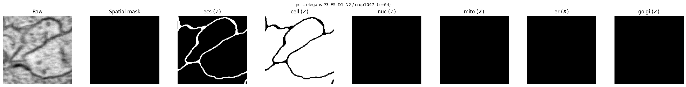

# mia_em_loader

Generic 3D multi-label EM data loading for CellMap-style Zarr datasets.



`mia_em_loader` provides PyTorch-compatible datasets and samplers for training neural networks on volumetric electron microscopy segmentation tasks with multiple organelle classes.

## Features

- **Zarr / OME-NGFF** native: reads CellMap-style multi-scale Zarr volumes directly
- **Multi-label**: load arbitrary combinations of organelle classes (mito, ER, nucleus, etc.)
- **Class-balanced sampling**: ensures rare classes are seen equally during training
- **MONAI augmentations**: built-in spatial and intensity transforms, or bring your own
- **Multi-dataset composition**: combine datasets from different sources with weighted sampling
- **Two-phase workflow**: discover crops once, reuse the metadata forever

## Installation

```bash
# Core
pip install .

# With MONAI augmentations
pip install ".[transforms]"

# Development
pip install -e ".[dev,transforms]"
```

**Requirements:** Python >= 3.10, PyTorch >= 2.0

## Quick Start

### 1. Discover crops (one-time)

```python
from mia_em_loader import discover_crops

db = discover_crops(
    data_root="/nrs/cellmap/data",
    norms_csv="norms.csv",
    target_classes=["ecs", "cell", "nuc", "mito", "er", "golgi"],
    target_resolution=8.0,
)
db.to_json("crops.json")
```

Or from the command line:

```bash
python -m mia_em_loader.discover \
    --data-root /nrs/cellmap/data \
    --norms-csv norms.csv \
    --target-classes ecs cell nuc mito er golgi \
    --output crops.json \
    --target-resolution 8.0
```

### 2. Create a dataset and train

```python
from mia_em_loader import (
    CropDatabase, CellMapDataset3D,
    ClassBalancedSampler, get_train_transforms,
)
from torch.utils.data import DataLoader

db = CropDatabase.from_json("crops.json")

train_ds = CellMapDataset3D(
    crop_db=db,
    target_classes=["mito", "er", "nucleus"],
    input_size=(128, 128, 128),
    output_size=(64, 64, 64),
    target_resolution=8.0,
    samples_per_epoch=5000,
    transforms=get_train_transforms(),
)

loader = DataLoader(
    train_ds,
    batch_size=4,
    sampler=ClassBalancedSampler(train_ds, samples_per_epoch=5000),
    num_workers=8,
)

for raw, labels, ann_mask, spatial_mask, meta in loader:
    # raw:          [B, 1, 128, 128, 128]
    # labels:       [B, 3,  64,  64,  64]
    # ann_mask:     [B, 3]                  (which classes are annotated)
    # spatial_mask: [B, 1,  64,  64,  64]   (valid region)
    pred = model(raw)
    loss = criterion(pred, labels, ann_mask, spatial_mask)
    loss.backward()
    optimizer.step()
```

### 3. Combine multiple datasets

```python
from mia_em_loader import ConcatMiaDataset

combined = ConcatMiaDataset(
    [ds_a, ds_b],
    weights=[0.6, 0.4],
    samples_per_epoch=1000,
)
```

## Architecture

```
mia_em_loader/
├── discover.py      # One-time crop discovery from Zarr hierarchy
├── models.py        # CropDatabase, CropInfo, NormParams, ClassInfo
├── base.py          # MiaDataset3D abstract base class
├── dataset.py       # CellMapDataset3D (main dataset)
├── concat.py        # ConcatMiaDataset (multi-dataset composition)
├── sampler.py       # ClassBalancedSampler
├── transforms.py    # EMTransforms (MONAI-based augmentations)
└── utils/
    └── ds_multiscale_utils.py  # Zarr I/O and OME-NGFF helpers
```

See [docs/architecture.md](docs/architecture.md) for detailed data flow diagrams and the full PyTorch integration map.

## Custom Transforms

Any callable with signature `(raw: Tensor, labels: Tensor) -> (raw, labels)` works:

```python
from mia_em_loader import EMTransforms

class MyTransforms:
    def __init__(self):
        self.base = EMTransforms(spatial_prob=0.5, intensity_prob=0.3)

    def __call__(self, raw, labels):
        raw, labels = self.base(raw, labels)
        # add your custom augmentations here
        return raw, labels

ds = CellMapDataset3D(..., transforms=MyTransforms())
```

See [docs/architecture.md](docs/architecture.md#how-to-add-custom-transforms) for more options and the full transform contract.

## Examples

| Script | Description |
|--------|-------------|
| [examples/cellmap_demo.py](examples/cellmap_demo.py) | Single-dataset loading with visualization |
| [examples/concat_demo.py](examples/concat_demo.py) | Multi-dataset composition and custom dataset validation |
| [examples/benchmark_workers.py](examples/benchmark_workers.py) | DataLoader performance profiling |

## License

BSD-3-Clause
